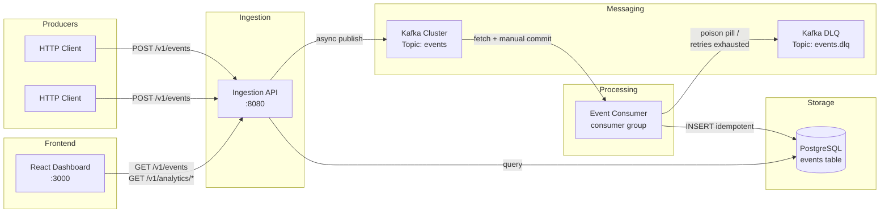
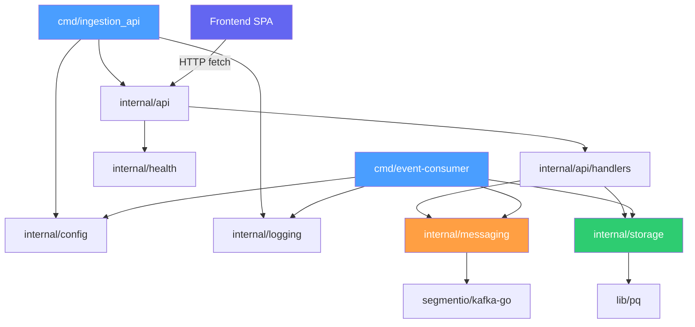
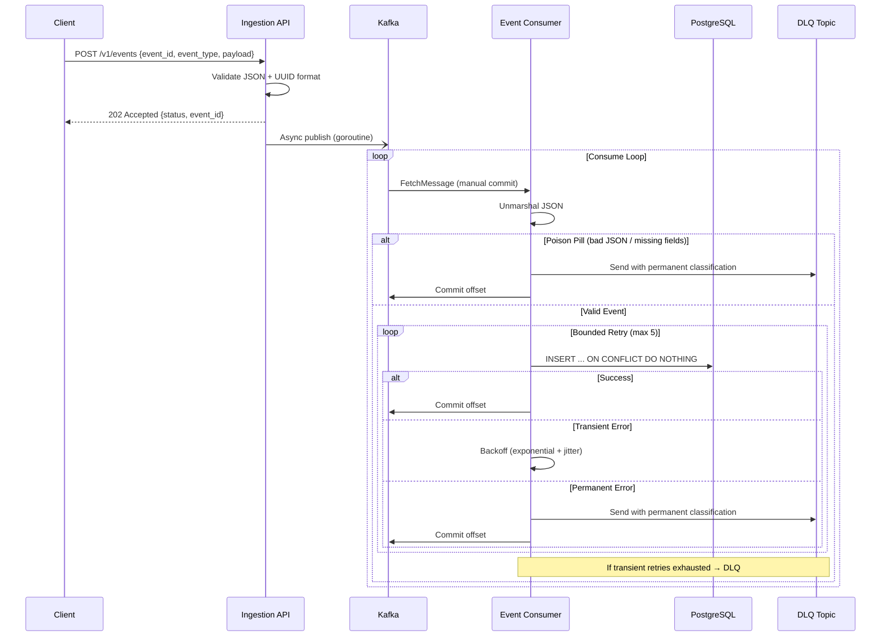
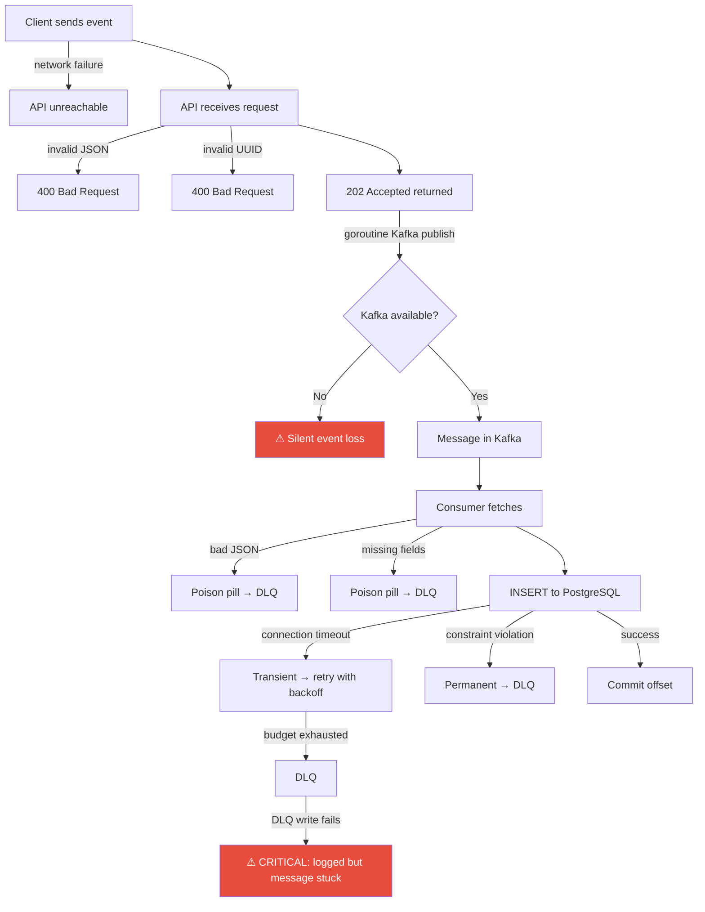
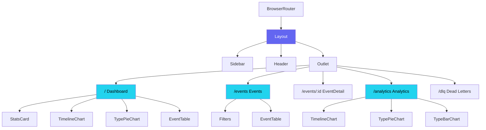
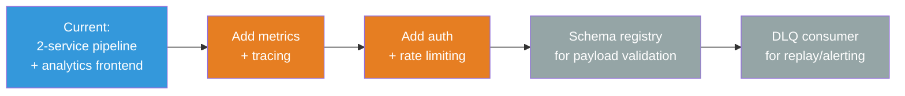

# Event Analytics Platform — Technical Documentation

> **Version:** 1.1  
> **Last updated:** 2026-02-16  
> **Language / Runtime:** Go 1.25 · Kafka (Confluent 7.5) · PostgreSQL 15 · React 18 + TypeScript  
> **Architecture style:** Event-driven, two-service async pipeline with analytics frontend  

---

## Table of Contents

1. [System Overview](#1-system-overview)  
2. [Architecture Breakdown](#2-architecture-breakdown)  
3. [Domain Model](#3-domain-model)  
4. [Execution Flow](#4-execution-flow)  
5. [Key Design Decisions](#5-key-design-decisions)  
6. [Failure & Edge Case Analysis](#6-failure--edge-case-analysis)  
7. [Security Considerations](#7-security-considerations)  
8. [Developer Onboarding Guide](#8-developer-onboarding-guide)  
9. [Frontend Architecture](#9-frontend-architecture)  
10. [Suggested Improvements](#10-suggested-improvements)  

---

## 1. System Overview

### Purpose

The Event Analytics Platform is a **production-grade event ingestion and processing system** designed for marketplace-style applications. It accepts high-volume, bursty event traffic via a REST API, buffers events through Kafka, persists them durably into PostgreSQL with at-least-once delivery guarantees, and surfaces the data through a **React-based analytics dashboard**.

The backend focuses on correctness, durability, operational safety, and debuggability under failure. The frontend provides real-time visibility into the event pipeline with interactive charts, paginated event browsing, and aggregated analytics.

### High-Level Architecture



### Core Responsibilities

| Responsibility | Owner |
|---|---|
| Input validation & acceptance | Ingestion API |
| Durable buffering & backpressure | Kafka |
| Deserialization, persistence, correctness | Event Consumer |
| Idempotent storage with conflict resolution | PostgreSQL |
| Failed message isolation | DLQ (events.dlq topic) |
| Event browsing, analytics visualization | Frontend Dashboard |

---

## 2. Architecture Breakdown

### Major Components

#### Ingestion API (`cmd/ingestion_api`)

A stateless HTTP server built on [chi](https://github.com/go-chi/chi). Receives events via `POST /v1/events`, validates UUID format, and **asynchronously publishes** to Kafka before returning `202 Accepted`.

Key files:
- `cmd/ingestion_api/main.go` — HTTP server bootstrap  
- `internal/api/router.go` — Route registration (chi), CORS middleware  
- `internal/api/handlers/event.go` — Event handler with validation (POST)  
- `internal/api/handlers/query.go` — Query handlers for events & analytics (GET)  
- `internal/api/middleware/request_id.go` — X-Request-ID propagation  
- `internal/api/middleware/logging.go` — Request/response timing  

#### Event Consumer (`cmd/event-consumer`)

A long-running Kafka consumer that fetches messages, deserializes them, and writes to PostgreSQL. Implements full resilience:

- **Poison pill detection** — invalid JSON or missing required fields routed directly to DLQ  
- **Error classification** — each DB failure classified as transient or permanent  
- **Bounded retry** — exponential back-off with jitter, hard ceiling  
- **DLQ routing** — failed messages written to `events.dlq` with full forensic envelope  

Key files:
- `cmd/event-consumer/main.go` — Consumer loop + processMessage pipeline  
- `internal/messaging/consumer.go` — Kafka reader with manual commit  
- `internal/messaging/dlq.go` — DLQ producer + envelope format  
- `internal/messaging/errors.go` — Error classification engine  
- `internal/messaging/retry.go` — Exponential back-off + jitter  

#### Messaging Layer (`internal/messaging`)

| Component | Role |
|---|---|
| `Producer` | Writes events to `events` topic (used by Ingestion API) |
| `Consumer` | Reads from `events` topic with manual offset commit |
| `DLQProducer` | Writes failed messages to `events.dlq` topic |
| `RetryConfig` | Bounded exponential back-off with jitter |
| `Classify()` | Inspects errors → transient or permanent |

All Kafka writers use `RequiredAcks: RequireAll` (ISR acknowledgment) and `LeastBytes` balancing.

#### Storage Layer (`internal/storage`)

Thin wrapper over `database/sql` targeting PostgreSQL. Connection pool tuned to 25 open / 5 idle / 5-minute lifetime.

| Method | Purpose |
|---|---|
| `InsertEvent()` | Idempotent upsert via `ON CONFLICT (event_id) DO NOTHING` |
| `GetEvents()` | Paginated, filterable event listing (type, date range) |
| `GetEvent()` | Single event lookup by UUID |
| `GetSummary()` | Aggregate stats: total, today, distinct types, top 5 |
| `GetTypeCounts()` | Event counts grouped by `event_type` |
| `GetTimeline()` | Hourly event counts for a configurable window |

#### Configuration (`internal/config`)

All configuration sourced from environment variables with sensible defaults. No config files, no feature flags. Flat struct, fully enumerable.

### Dependency Relationships



### External Integrations

| System | Protocol | Purpose |
|---|---|---|
| Apache Kafka | TCP (Kafka protocol) | Event buffering, DLQ |
| PostgreSQL 15 | TCP (libpq) | Durable event storage |
| ZooKeeper | TCP | Kafka coordination (Confluent 7.5 dependency) |

---

## 3. Domain Model

### Key Entities

#### Event (API Request)

```go
type EventRequest struct {
    EventID string          `json:"event_id"`  // UUID, client-generated
    Type    string          `json:"event_type"` // e.g. "click", "purchase"
    Payload json.RawMessage `json:"payload"`    // opaque JSON blob
}
```

#### Event (Database Row)

```sql
CREATE TABLE events (
    event_id    UUID PRIMARY KEY,
    event_type  VARCHAR(255) NOT NULL,
    payload     JSONB NOT NULL DEFAULT '{}',
    received_at TIMESTAMPTZ NOT NULL DEFAULT NOW()
);
```

#### DLQ Envelope

```go
type DLQMessage struct {
    OriginalTopic     string          `json:"original_topic"`
    OriginalPartition int             `json:"original_partition"`
    OriginalOffset    int64           `json:"original_offset"`
    OriginalKey       string          `json:"original_key"`
    OriginalValue     json.RawMessage `json:"original_value"`
    ErrorMessage      string          `json:"error_message"`
    ErrorKind         string          `json:"error_kind"`   // "transient" | "permanent"
    Retries           int             `json:"retries"`
    FailedAt          time.Time       `json:"failed_at"`
}
```

### Data Transformations

| Stage | Transformation |
|---|---|
| API ingestion | JSON body → `EventRequest` struct → re-serialized as Kafka message value |
| Kafka transport | Bytes on wire; key = `event_id`, value = JSON |
| Consumer | Kafka message → `event` struct → PostgreSQL `INSERT` with `event_id`, `event_type`, `payload` |
| DLQ routing | Original Kafka message → wrapped in `DLQMessage` envelope with failure metadata |

### Important Invariants

1. **`event_id` is globally unique and client-generated.** The entire idempotency model relies on clients generating UUIDs. Duplicate IDs result in `DO NOTHING`, not upserts.
2. **An event is "accepted" when Kafka acknowledges it**, not when it reaches the database. The API returns `202 Accepted` after a successful Kafka write.
3. **Offsets are committed only after a successful DB write** (or after DLQ routing). This guarantees at-least-once delivery — no silent drops.
4. **Payload is opaque.** The system never inspects `payload` contents. Schema validation is the producer's responsibility.
5. **Append-only storage.** Events are never updated or deleted through the application layer.

---

## 4. Execution Flow

### Event Lifecycle (End-to-End)



### Request Lifecycle (Ingestion API)

1. HTTP request arrives at `POST /v1/events`
2. `RequestID` middleware assigns/propagates `X-Request-ID`
3. `Logging` middleware records start time
4. `HandleEvent` handler:
   - Decodes JSON body
   - Validates `event_id` as UUID
   - Spawns goroutine to publish to Kafka (5s timeout)
   - Returns `202 Accepted` immediately
5. Logging middleware records response duration

### Message Processing Lifecycle (Consumer)

1. `FetchMessage` blocks until a message is available (or context cancelled)
2. **Poison pill check #1:** JSON unmarshal — invalid → DLQ + commit
3. **Poison pill check #2:** Required fields (`event_id`, `event_type`) — missing → DLQ + commit
4. **Retry loop (attempt 0..MaxRetries-1):**
   - `InsertEvent` with 5s timeout
   - Success → commit offset → log → done
   - Error → `Classify()`:
     - Permanent → DLQ + commit → done
     - Transient + budget remaining → `Sleep()` with backoff → next attempt
     - Transient + budget exhausted → DLQ + commit → done
5. Shutdown: context cancellation during sleep exits cleanly without committing

---

## 5. Key Design Decisions

### Why This Structure Exists

The codebase follows Go's **standard project layout** (`cmd/`, `internal/`, `pkg/`) with a clear separation between two independently deployable binaries — the API and the consumer. This is not a monolith; it's a **two-service async pipeline** sharing internal libraries via `internal/`.

The `internal/` boundary enforces that no external package can import these modules, keeping the API surface minimal and the blast radius of changes contained.

### Trade-offs Visible in the Implementation

| Decision | Trade-off |
|---|---|
| **Async publish in goroutine** | API returns fast (`202`) but Kafka write failures are invisible to the caller. A crash between response and publish loses the event. |
| **At-least-once delivery** | Duplicate processing is possible. Mitigated by `ON CONFLICT DO NOTHING` but requires client-generated unique IDs. |
| **`json.RawMessage` for payload** | No schema validation on payload contents. Fast and flexible, but allows garbage in. |
| **Manual offset commit** | Guarantees no silent drops but increases complexity. A consumer crash mid-processing replays the message. |
| **String-based error classification** | `Classify()` uses `strings.Contains` on error messages. Fragile if postgres driver changes error wording; but practical and effective. |
| **Single consumer group** | Simplicity. Scaling requires adding consumers to the group, not changing code. |

### Scalability Considerations

- **Ingestion API** is stateless — scale horizontally behind a load balancer.
- **Consumer** scales within a Kafka consumer group (one consumer per partition).
- **PostgreSQL** is the bottleneck at scale. Connection pool is capped at 25. No read replicas, no sharding, no partitioning.
- **Kafka** runs single-broker with replication factor 1 in dev. Production would need multi-broker with RF ≥ 3.

### Observability Patterns

| Pattern | Implementation |
|---|---|
| **Structured logging** | Custom `Logger` emitting `map[string]any` with `level`, `service`, `message` fields |
| **Request tracing** | `X-Request-ID` header propagated via context |
| **Health checks** | `/healthz` (liveness) and `/readyz` (readiness) endpoints |
| **Error classification** | Every consumer failure tagged `transient` or `permanent` in logs |
| **DLQ forensics** | Full original message + failure metadata preserved in DLQ envelope |

**Not yet implemented:** Prometheus metrics, distributed tracing (OpenTelemetry), log-level filtering.

---

## 6. Failure & Edge Case Analysis

### Where Failures May Occur



### Error Handling Strategy

| Layer | Strategy |
|---|---|
| **API** | Synchronous validation → 400/202 response codes. Kafka publish errors are logged but not surfaced to caller. |
| **Consumer: Poison pills** | Invalid JSON or missing required fields → permanent DLQ → commit → move on |
| **Consumer: DB transient** | Bounded retry (5 attempts, 200ms→10s backoff) → DLQ on exhaustion |
| **Consumer: DB permanent** | No retry → immediate DLQ |
| **Consumer: DLQ write failure** | Logged at CRITICAL level. Offset not committed — message will be replayed. |
| **Shutdown** | SIGINT/SIGTERM → context cancellation. In-flight retries abort cleanly without committing (safe for replay). |

### Error Classification Rules

```
Transient (retryable):
  - net.Error (any network error)
  - io.EOF / io.ErrUnexpectedEOF
  - syscall.ECONNREFUSED / ECONNRESET
  - Error messages containing: "connection refused", "connection reset", "timeout", "too many clients"
  - Unknown errors (default-to-transient policy)

Permanent (non-retryable):
  - Explicit ProcessingError{Kind: ErrPermanent}
  - Error messages containing: "unique constraint", "violates check constraint", "invalid input syntax"
```

### Potential Technical Debt

1. **Silent event loss on API's async publish.** The goroutine publish in `HandleEvent` has no feedback loop. If Kafka is down, events accepted via `202` are lost. This is the largest correctness risk in the system.
2. **String-based error matching in `Classify()`.** Depends on error message text from `lib/pq`. A driver upgrade could change wording and cause misclassification.
3. **Empty stub files.** `ratelimit.go`, `apikey.go`, `validation/even.go` are empty — they compile to valid (empty) packages but represent incomplete features.
4. **Router does not wire middleware or producer.** `NewRouter()` does not use `Logging`, `RequestID` middleware, and `HandleEvent` expects a `*Producer` argument but the router calls it without one (compilation error in `internal/api`).
5. **No consumer-side health probe.** The consumer binary has no `/healthz` or `/readyz` endpoint for Kubernetes liveness checks. Kubernetes cannot distinguish a stuck consumer from a healthy one.

---

## 7. Security Considerations

### Input Validation

| Check | Implementation | Gap |
|---|---|---|
| JSON structure | `json.Decoder` in handler | No max body size limit — potential OOM on large payloads |
| `event_id` format | `uuid.Parse()` | Correct. Rejects non-UUID values. |
| `event_type` presence | **Checked in consumer only** | Not checked in API handler — invalid events reach Kafka |
| `payload` contents | None (opaque `json.RawMessage`) | By design; but allows arbitrarily large/nested JSON |

### Authentication / Authorization

- **Not implemented.** `internal/auth/apikey.go` exists but is empty.
- The API accepts unauthenticated requests on all endpoints.
- No rate limiting is implemented (`ratelimit.go` is empty).

### Data Exposure Risks

| Risk | Severity | Status |
|---|---|---|
| Database credentials in env vars with defaults in source | Medium | Dev defaults hardcoded in `config.go` |
| No TLS between services (Kafka PLAINTEXT, Postgres sslmode=disable) | High | Expected for local dev; must change for production |
| DLQ contains full original message payloads | Low | By design for forensics, but may contain PII |
| No audit logging of who submitted events | Medium | No auth = no attribution |

---

## 8. Developer Onboarding Guide

### Prerequisites

- Go 1.25+
- Docker & Docker Compose
- `psql` client (optional, for manual DB inspection)

### Running Locally

**1. Start infrastructure:**

```bash
docker-compose up -d
```

This starts ZooKeeper (port 2181), Kafka (port 9093), and PostgreSQL (port 5432).

**2. Apply database migrations:**

```powershell
Get-Content migrations/000001_create_events_table.up.sql | docker-compose exec -T postgres psql -U events_user -d events_db
```

Or on Linux/Mac:
```bash
cat migrations/000001_create_events_table.up.sql | docker-compose exec -T postgres psql -U events_user -d events_db
```

**3. Build and run the Ingestion API:**

```bash
go build -o ingestion_api.exe ./cmd/ingestion_api
./ingestion_api.exe
```

**4. Build and run the Event Consumer:**

```bash
go build -o event_consumer.exe ./cmd/event-consumer
./event_consumer.exe
```

**5. Send a test event:**

```bash
curl -X POST http://localhost:8080/v1/events \
  -H "Content-Type: application/json" \
  -d '{"event_id":"550e8400-e29b-41d4-a716-446655440000","event_type":"click","payload":{"page":"/home"}}'
```

**6. Start the frontend:**

```bash
cd Event_Analytics_Platform/frontend
npm install
npm run dev
```

The dashboard opens at http://localhost:3000. The Vite dev server proxies all `/v1/*` API calls to the Go backend on `:8080`.

### Environment Variables

| Variable | Default | Used By | Description |
|---|---|---|---|
| `SERVICE_NAME` | `ingestion-api` | Both | Service identifier in logs |
| `PORT` | `8080` | API | HTTP listen port |
| `LOG_LEVEL` | `info` | Both | Log verbosity |
| `KAFKA_BROKERS` | `localhost:9093` | Both | Comma-separated broker list |
| `KAFKA_TOPIC` | `events` | Both | Primary event topic |
| `KAFKA_GROUP_ID` | `event-consumer-group` | Consumer | Consumer group ID |
| `KAFKA_DLQ_TOPIC` | `events.dlq` | Consumer | Dead-letter topic |
| `MAX_RETRIES` | `5` | Consumer | Max retry attempts for transient failures |
| `DB_USER` | `events_user` | Consumer | PostgreSQL username |
| `DB_PASSWORD` | `events_password` | Consumer | PostgreSQL password |
| `DB_HOST` | `localhost` | Consumer | PostgreSQL host |
| `DB_PORT` | `5432` | Consumer | PostgreSQL port |
| `DB_NAME` | `events_db` | Consumer | PostgreSQL database |

### How to Add a New Feature Correctly

**Adding a new event processing step (e.g. enrichment before DB write):**

1. Add the logic in `cmd/event-consumer/main.go` inside `processMessage()`, between poison pill checks and the DB insert loop.
2. If the new step can fail, classify the error using `messaging.Classify()` and follow the same retry/DLQ pattern.
3. Add unit tests in `internal/messaging/failure_injection_test.go` simulating the new failure mode.

**Adding a new API endpoint:**

1. Create a handler function in `internal/api/handlers/`.
2. Register the route in `internal/api/router.go` under the `/v1` group.
3. Wire any middleware in the router (currently not done for existing middleware).

**Adding a new Kafka topic:**

1. Add the topic name as a config field in `internal/config/config.go`.
2. Create a new `Producer` or `Consumer` instance in the relevant `cmd/` main.
3. Kafka auto-creates topics by default in dev; for production, pre-create topics with proper partition/replication config.

### Running Tests

```bash
go test -v ./internal/messaging/...
```

The test suite includes 27 tests covering:
- Error classification (network, postgres, unknown errors)
- Retry discipline (budget, backoff, jitter, context cancellation)
- DLQ envelope serialization
- 8 failure injection scenarios (poison pills, transient recovery, budget exhaustion, permanent failures, zero-retry config)

---

## 9. Frontend Architecture

### Overview

The frontend is a **single-page application** built with React 18 and TypeScript, bundled by Vite. It connects to the Ingestion API's read endpoints to provide real-time event browsing, analytics dashboards, and system health monitoring.

### Tech Stack

| Technology | Purpose |
|---|---|
| **React 18** | UI framework with functional components and hooks |
| **React Router v6** | Client-side routing with nested layout routes |
| **Recharts** | Charting library (Area, Pie, Bar charts) |
| **Lucide React** | Icon library |
| **date-fns** | Date formatting and relative time |
| **TypeScript** | Static type safety across all components |
| **Vite** | Dev server with HMR + API proxy to Go backend |

### Page Architecture



### API Integration

The frontend uses a custom `useApi` hook for data fetching with automatic loading/error state management. All API calls go through fetch-based typed service functions.

| Frontend Page | Backend Endpoint | Data |
|---|---|---|
| Dashboard | `GET /v1/analytics/summary` | Total events, today count, distinct types |
| Dashboard | `GET /v1/analytics/timeline?hours=24` | Event volume chart data |
| Dashboard | `GET /v1/analytics/types` | Type distribution for pie chart |
| Dashboard | `GET /v1/events?limit=10` | Recent events table |
| Events | `GET /v1/events?type=&from=&to=&limit=&offset=` | Paginated, filtered event list |
| Event Detail | `GET /v1/events/{id}` | Single event with full payload |
| Analytics | `GET /v1/analytics/summary` | Summary statistics |
| Analytics | `GET /v1/analytics/timeline?hours=N` | Configurable timeline (6h–7d) |
| Analytics | `GET /v1/analytics/types` | Type distribution (pie + bar) |
| All pages | `GET /healthz` | Backend health status in header |

### Component Hierarchy

| Component | Type | Responsibility |
|---|---|---|
| `Layout` | Layout | Sidebar + Header + routed content via `<Outlet>` |
| `Sidebar` | Navigation | App navigation with active route highlighting |
| `Header` | Chrome | Page title + live health badge (polls every 30s) |
| `StatsCard` | Data display | Single metric with icon, value, and optional trend |
| `EventTable` | Data display | Clickable event rows with type badges, truncated payloads |
| `EventChart` | Visualization | Timeline (Area), type distribution (Pie), type counts (Bar) |
| `Filters` | Input | Type select, date range pickers, search/clear actions |
| `Loading` | Feedback | Spinner with configurable message |
| `StatusBadge` | Feedback | Color-coded status indicator |

### Dev Server Proxy

Vite proxies API requests to the Go backend during development:

```typescript
// vite.config.ts
server: {
  port: 3000,
  proxy: {
    '/v1':      { target: 'http://localhost:8080' },
    '/healthz': { target: 'http://localhost:8080' },
    '/readyz':  { target: 'http://localhost:8080' },
  }
}
```

This means the frontend dev server runs on `:3000` and all `/v1/*` requests are forwarded to the Go API on `:8080`, avoiding CORS issues during development.

### Styling

The frontend uses a CSS custom properties-based dark theme with no CSS framework:

| Variable | Value | Purpose |
|---|---|---|
| `--bg` | `#0f1117` | Page background |
| `--surface` | `#1a1d27` | Card/sidebar background |
| `--accent` | `#6366f1` | Primary accent (indigo) |
| `--text` | `#e4e5e9` | Primary text |
| `--text-dim` | `#8b8d97` | Secondary text |

The layout is responsive — the sidebar collapses on screens below 768px.

---

## 10. Suggested Improvements

### Critical (Correctness)

| Issue | Risk | Fix |
|---|---|---|
| **Async goroutine publish loses events** | Events vanish if Kafka is down after `202 Accepted` | Publish synchronously before returning 202, or use a local WAL (write-ahead log) for crash recovery |
| **Router doesn't wire producer or middleware** | API handler panics at runtime (`HandleEvent` needs `*Producer`) | Fix `NewRouter()` to accept dependencies and register middleware |
| **No request body size limit** | OOM on large malicious payloads | Add `http.MaxBytesReader` in handler or middleware |

### High (Reliability)

| Issue | Risk | Fix |
|---|---|---|
| **No consumer health endpoint** | Kubernetes cannot detect stuck consumers | Add an HTTP health server in the consumer binary |
| **No authentication** | Open API accepting traffic from anyone | Implement API key middleware (`apikey.go` is stubbed) |
| **No rate limiting** | Single client can overwhelm the pipeline | Implement token bucket rate limiter (`ratelimit.go` is stubbed) |
| **String-based error classification** | Driver update breaks classification | Use Postgres error codes (`pq.Error.Code`) instead of string matching |

### Medium (Operational)

| Issue | Risk | Fix |
|---|---|---|
| **No Prometheus metrics** | Blind to throughput, latency, error rates | Add `promhttp` handler + counters for events ingested, published, persisted, DLQ'd |
| **No distributed tracing** | Cannot trace event from API to DB | Add OpenTelemetry spans across API → Kafka → Consumer → DB |
| **Logger outputs Go maps** | Not parseable by log aggregators | Switch to JSON-structured logging (e.g. `slog`, `zerolog`) |
| **No migration framework** | Manual SQL execution | Integrate `golang-migrate` or `goose` for versioned migrations |
| **K8s manifests are empty** | Cannot actually deploy to Kubernetes | Populate deployment specs, resource limits, probes, and ConfigMaps |

### Low (Code Quality)

| Issue | Impact | Fix |
|---|---|---|
| **Empty stub files** (`ratelimit.go`, `apikey.go`, `even.go`) | Build warnings, confusion | Either implement or remove |
| **Typo in directory name** | `desgin/` instead of `design/` | Rename directory |
| **No `Dockerfile`** | `Dockerfile.ingestion` is empty | Add multi-stage Go build Dockerfile |
| **`event_type` not validated at API layer** | Invalid types pass through to Kafka | Add validation with allowlist or regex in handler |

### Architecture Evolution Path



---

## Appendix: Project Structure Reference

```
Event_Analytics_Platform/
├── cmd/
│   ├── ingestion_api/main.go        # HTTP server binary
│   └── event-consumer/main.go       # Kafka consumer binary
├── internal/
│   ├── api/
│   │   ├── router.go                # Chi route registration + CORS
│   │   ├── handlers/event.go        # POST /v1/events handler
│   │   ├── handlers/query.go        # GET /v1/events, /v1/analytics/* handlers
│   │   └── middleware/
│   │       ├── logging.go           # Request duration logging
│   │       ├── request_id.go        # X-Request-ID propagation
│   │       └── ratelimit.go         # (empty stub)
│   ├── auth/apikey.go               # (empty stub)
│   ├── config/config.go             # Env-based configuration
│   ├── health/health.go             # /healthz, /readyz
│   ├── logging/logger.go            # Structured logger
│   ├── messaging/
│   │   ├── producer.go              # Kafka writer (events topic)
│   │   ├── consumer.go              # Kafka reader (manual commit)
│   │   ├── dlq.go                   # Dead-letter queue producer
│   │   ├── errors.go                # Error classification engine
│   │   ├── retry.go                 # Bounded exponential backoff
│   │   ├── errors_test.go           # Classification unit tests
│   │   ├── retry_test.go            # Retry discipline tests
│   │   ├── dlq_test.go              # DLQ envelope tests
│   │   └── failure_injection_test.go # 8 failure scenario tests
│   ├── storage/postgres.go          # PostgreSQL client (insert + query layer)
│   └── validation/even.go           # (empty stub)
├── migrations/
│   ├── 000001_create_events_table.up.sql
│   └── 000001_create_events_table.down.sql
├── Event_Analytics_Platform/frontend/
│   ├── index.html                   # Vite entry point
│   ├── package.json                 # React 18, Router 6, Recharts, Lucide, date-fns
│   ├── vite.config.ts               # Dev server + API proxy to :8080
│   ├── tsconfig.json                # Strict TypeScript config
│   └── src/
│       ├── main.tsx                 # React root mount
│       ├── App.tsx                  # BrowserRouter + route definitions
│       ├── components/
│       │   ├── Layout.tsx           # Sidebar + Header + Outlet
│       │   ├── Sidebar.tsx          # Navigation with active route highlighting
│       │   ├── Header.tsx           # Page title + live health badge
│       │   ├── StatsCard.tsx        # Single metric card
│       │   ├── EventTable.tsx       # Clickable event rows
│       │   ├── EventChart.tsx       # Area, Pie, Bar charts (Recharts)
│       │   ├── Filters.tsx          # Type + date range filters
│       │   ├── Loading.tsx          # Spinner component
│       │   └── StatusBadge.tsx      # Color-coded status indicator
│       ├── pages/
│       │   ├── Dashboard.tsx        # Stats + timeline + type dist + recent events
│       │   ├── Events.tsx           # Filterable, paginated event list
│       │   ├── EventDetail.tsx      # Single event metadata + JSON viewer
│       │   ├── Analytics.tsx        # Configurable charts (6h–7d)
│       │   └── DLQ.tsx              # DLQ envelope docs + roadmap
│       ├── hooks/useApi.ts          # Generic data-fetching hook
│       ├── services/api.ts          # Typed API client (fetch-based)
│       ├── types/index.ts           # TypeScript interfaces
│       ├── utils/formatters.ts      # Date/number formatters
│       └── styles/index.css         # Dark-theme CSS (custom properties)
├── deploy/
│   ├── docker/Dockerfile.ingestion  # (empty)
│   └── k8s/                         # (all empty stubs)
├── desgin/                           # Architecture decision records
├── docker-compose.yml                # Kafka + ZooKeeper + PostgreSQL
├── go.mod
└── README.md
```
